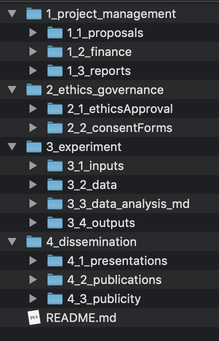

================
Folder Structure
================

The folder structure for the project follows the format illustrated below:

====

--------------------
1_project_management
--------------------

This is not uploaded to git.

--------------------
2_ethics_governence
--------------------

This is not uploaded to git.

--------------------
3_experiment
--------------------

This is where most of the project lives.

3_1_inputs
-----------
Refers to the tools used to capture information, including:

- Experiment code
    * including all assets (e.g. photos)
- Questionnaires

3_2_data
--------
Raw data lives here.

3_3_data_analysis
-----------------

This includes:

- Scripts for preprocessing and cleaning data
- Processed data
- Scripts for analyzing processed data

3_4_outputs
-----------

This includes:

- Plots
- Tables
- Markdown results section (theoretically)

--------------------
4_dissemination
--------------------

Presentations, publications and publicity live here.

-----
docs
-----

There is also a folder that has been added by `Sphinx`_,
and is where all the documentation lives.

.. note::

    Keep in mind that if you are using the Read the Docs documentation
    there is always the option to add/edit.

Just look for this image on the top right of the page:

.. image:: ../_static/images/edit_on_github.png
   :width: 250
   :alt: edit on github image

Click on it (which automatically forks it), make your edits
and then create a pull request.

.. _Sphinx: http://www.sphinx-doc.org/en/master/
