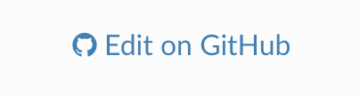

===============
Getting Started
===============

This documentation will cover some of the basics of the project,
and hopefully put you in a position to run the
experiment and analyze data yourself.

----------------------
Running the Experiment
----------------------

The experiment protocol can be found on Dropbox at
``DJW_Projects/02_FOOD_REG/PAPERWORK/fMRI_Food_Regulation_Experiment_Protocol.gdoc``

The protocol includes information regarding:

- Booking Scanner Time
- Recruiting Participants
- Running Study

The study questionnaire is a Google Form, and lives on the lab's
Google Drive account.

----------------------
Updating Documentation
----------------------

.. note::

    Keep in mind that if you are using the Read the Docs documentation
    there is always the option to add/edit.

Just look for this image on the top right of the page:

Click on it (which automatically forks it), make your edits
and then create a pull request.
